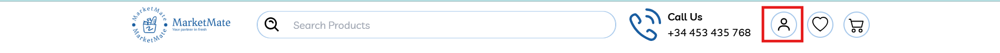
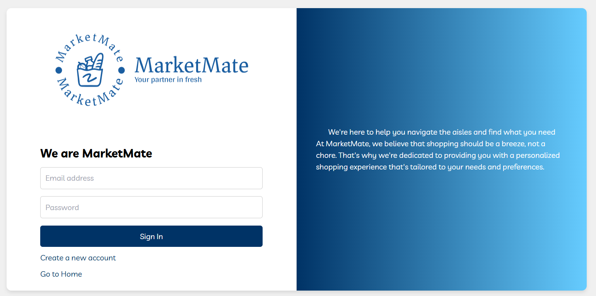
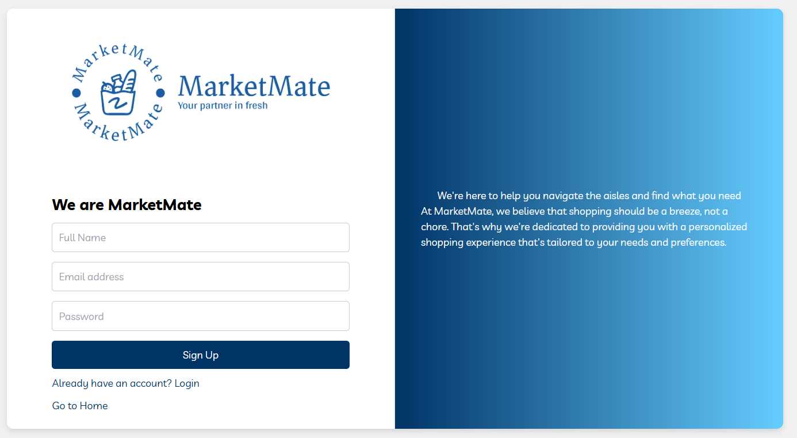
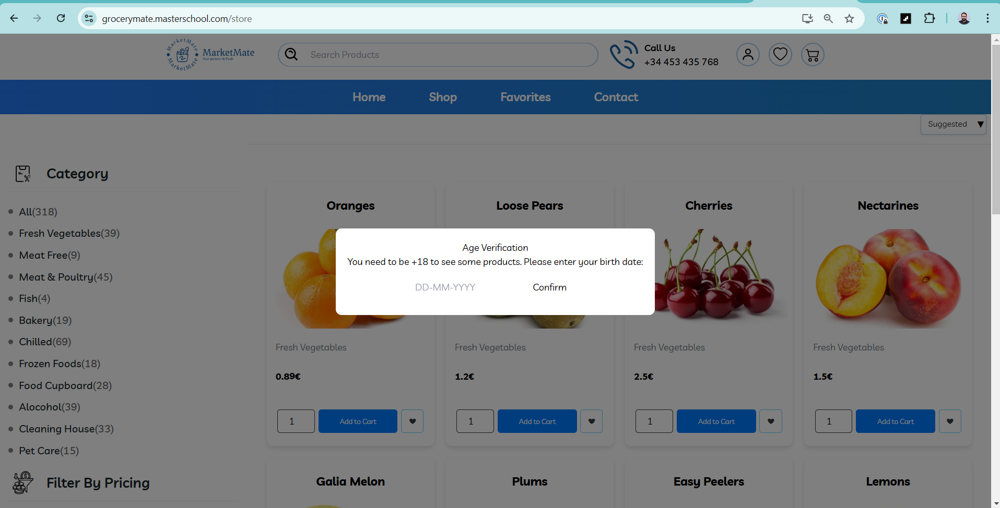

## Hausaufgabe - XPath 
### **Aufgabe 2**
```
https://grocerymate.masterschool.com
```
* **XPath für das im untenstehenden Bild hervorgehobene Symbol/den hervorgehobenen Button:**



``` 
//div[@class="headerIcon"]
```

---

**XPath für alle Eingabefelder, die `"Sign In"`-Schaltfläche, den Link `"Create a new account"` und 
    den Link `"Go to Home"`:**


* **E-Mail-Feld:**
  ```
  //input[@placeholder='Email address']
  ```
* **Password-Feld:**
  ```
  //input[@placeholder='Password']
  ```
* **Sign In Button:**
  * `and text()='Singn In'` ist optional aber eindeutiger
  ```
  //button[@class='submit-btn' and text()='Sign In']
  ```

* **Create a new account**
  ```
  //a[@class='switch-link' and text()='Create a new account']
  ```

* **Go to Home**
  ```
  //a[@class='home-link' and text()='Go to Home']
  ```

---

**XPath für `alle Eingabefelder` und die `Sign Up`-Schaltfläche:**



* Full Name
    ```
    //input[@placeholder='Full Name']
    ```
* E-Mail-Feld
    ```
    //input[@placeholder='Email address']
    ```
* Password-Feld
    ```
    //input[@placeholder='Password']
    ```
* Sign-Up button
    ```
    //button[@class='submit-btn' and text()='Sign Up']
    ```

---

**XPath der `Confirm`-Schaltfläche, Mengeneingabefeld von `Oranges`, `Add to cart` & `Add to wish list`:**



* Confirm-Button
  ```
  //button[text()='Confirm']
  ```
* Mengeneingabefeld von `Oranges`
  ```
  //input[@name="quantity_66b3a57b3fd5048eacb4798f"]
  ```
* Add to cart
  ```
  //button[@class="btn btn-primary btn-cart" and text()='Add to Cart']
  ```
* Add to wish list

  ```
  //button[@class="btn btn-outline-dark" and text()='❤️']
    
  oder:
    
  //div[h2/text()='Oranges']//button[@class="btn btn-outline-dark"]
  ```
  Hinweis: Emoji im Text kann bei manchen Browsern/Tools problematisch sein.
  Alternativ kann man den Button relativ zum Produkt „Oranges“ auswählen, um die Stabilität zu erhöhen.
