# Test Execution - GroceryMate

**Tester:** Marc Maier  
**Datum:** 21.11.2025  
**Testumgebung:** Chrome 142 / MacOS 15.6.1 

---

## TC-01 Produkt bewerten (5 Sterne + Kommentar)

* **Precondition:** Eingeloggt mit Email = `test@test32567.de`, Password = `test123`, Produkt `Oranges` gekauft.
* **Steps:**
  1. Produktseite von `Oranges` öffnen.
  2. Scrolle zum Bewertungsbereich.
  3. Wähle 5 Sterne aus.
  4. Trage Kommentar "Tolles Produkt!" ein.
  5. Klicke auf **Send**.
* **Expected Result:** Bewertung erscheint korrekt mit 5 Sternen und Kommentar.
* **Actual Result:** Bewertung erscheint mit 5 Sternen und Username aber ohne Kommentar.
* 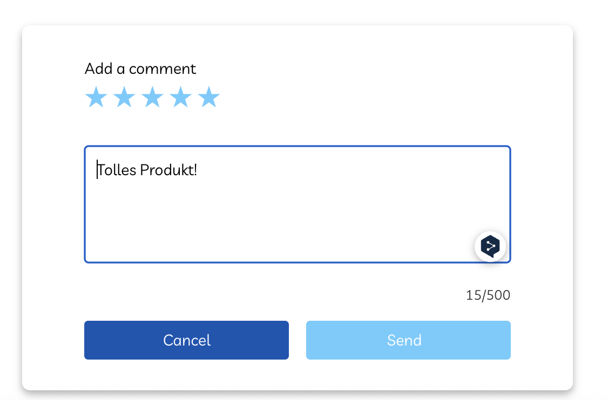
* 
* **Status:** FAILED

---

## TC-02 Produkt bewerten (4 Sterne, kein Kommentar)

* **Precondition:** Eingeloggt mit Email = `test@test32567.de`, Password = `test123`, Produkt `Loose Pears` gekauft.
* **Steps:**
  1. Produktseite von `Loose Pears` öffnen.
  2. Scrolle zum Bewertungsbereich.
  3. Wähle 4 Sterne aus.
  4. Lasse Kommentar-Feld leer.
  5. Klicke auf **Send**.
* **Expected Result:** Bewertung erscheint korrekt mit 4 Sternen und ohne Kommentar.
* **Actual Result:** Wie erwartet werden 4 Sterne ohne kommentar korrekt angezeigt.
* 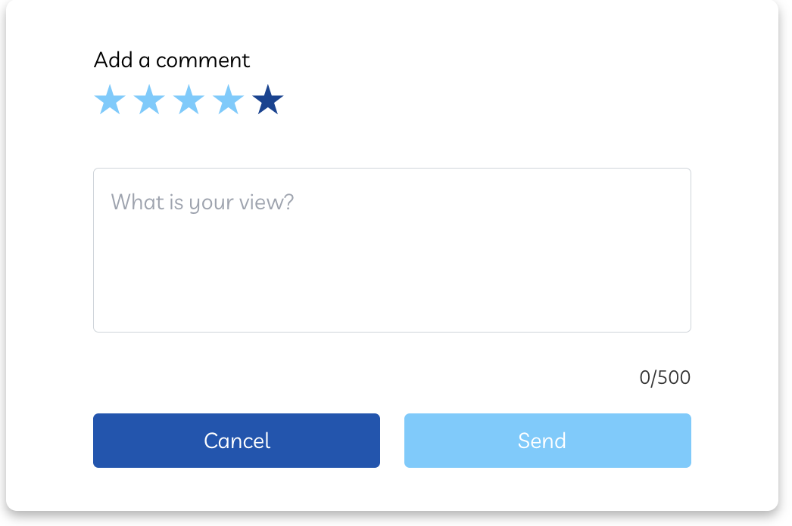
* 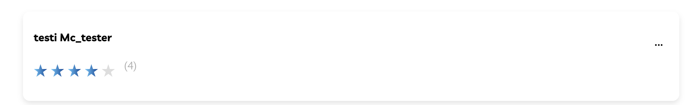
* **Status:** PASSED

---

## TC-03 Bewertung ohne Sterne (nur Text)

* **Precondition:** Eingeloggt mit Email = `test@test32567.de`, Password = `test123`, Produkt `Cherries` gekauft.
* **Steps:**
  1. Produktseite von `Cherries` öffnen.
  2. Scrolle zum Bewertungsbereich.
  3. Lasse Sterne ungewählt.
  4. Trage Kommentar `Gut` ein.
  5. Klicke auf **Send**.
* **Expected Result:** Popup erscheint oben mit Fehlermeldung, verschwindet automatisch, Bewertung wird nicht gespeichert.
* **Actual Result:** Wie erwartet erscheint ein Popup und gibt die Fehlermeldung:
    `Invalid input for the field 'Rating'. Please check your input.` aus.
* 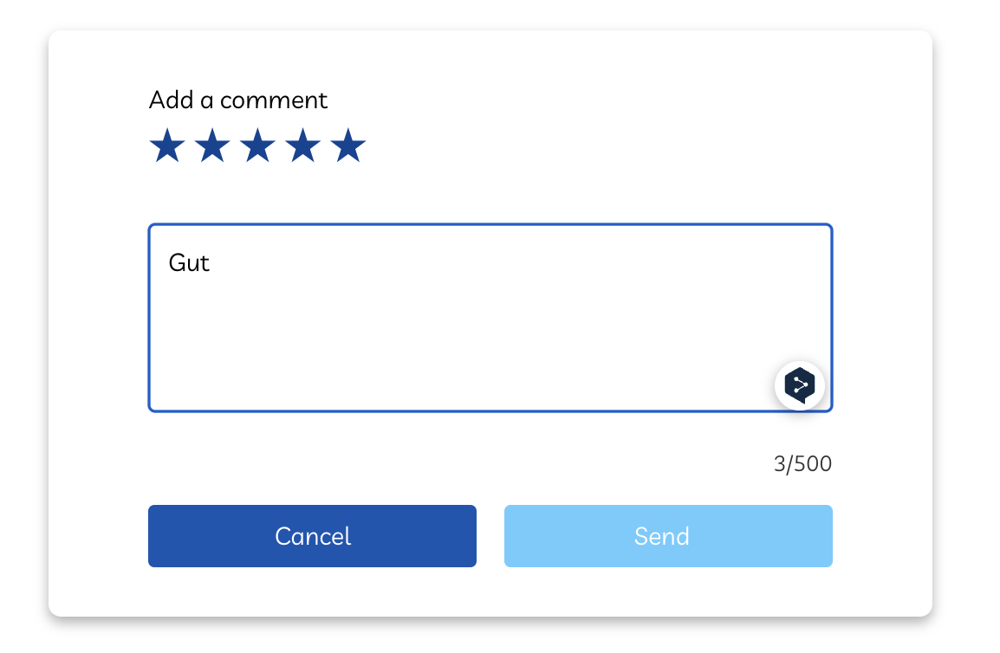
* 
* **Status:** PASSED

---

## TC-04 Altersverifikation: 18 Jahre (Zugriff erlauben)

* **Precondition:** Eingeloggt mit Email = `test@test32567.de`, Password = `test123`, Shop wird erstmals besucht
* **Steps:**
  1. Klicke auf Shop
  2. Warte, bis Altersverifikations-Popup erscheint.
  3. Gib Geburtsdatum `27-08-2007` ein.
  4. Klicke auf **Bestätigen**.
* **Expected Result:** Zugriff auf alkoholische Produkte freigegeben, Popup mit Bestätigung erscheint und verschwindet automatisch.
* **Actual Result:** Zugriff auf alkoholische Produkte freigeben, Popup mit Bestätigung erscheint und verschwindet automatisch.
* 
* 
* **Status:** PASSED

---

## TC-05 Altersverifikation: 17 Jahre (Zugriff verweigern)

* **Precondition:** Eingeloggt mit Email = `test@test32567.de`, Password = `test123`, Shop wird erstmals besucht
* **Steps:**
  1. Klicke auf **Shop**
  2. Warte, bis Altersverifikations-Popup erscheint.
  3. Gib Geburtsdatum `27-08-2008` ein.
  4. Klicke auf **Bestätigen**.
* **Expected Result:** Zugriff auf alkoholische Produkte verweigert, Warn-Popup erscheint und verschwindet automatisch.
* **Actual Result:** Zugriff auf alkoholische Produkte verweigert, Warn-/Hinweis-Popup erscheint und verschwindet automatisch.
* 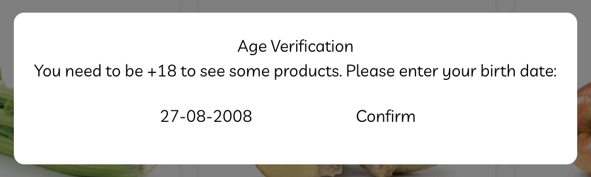
* 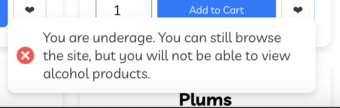
* **Status:** PASSED

---

## TC-06 Altersverifikation: Leeres Eingabefeld

* **Precondition:** Eingeloggt mit Email = `test@test32567.de`, Password = `test123`, Shop wird erstmals besucht
* **Steps:**
  1. Klicke auf **Shop**
  2. Warte, bis Altersverifikations-Popup erscheint.
  3. Lasse Geburtsdatumsfeld leer.
  4. Klicke auf **Bestätigen**.
* **Expected Result:** Kein Zugriff auf alkoholische Produkte, Warn-Popup erscheint.
* **Actual Result:** Wie erwartet wird angenommen das der kunde unter 18 ist und bekommt den warn-Popup.
* 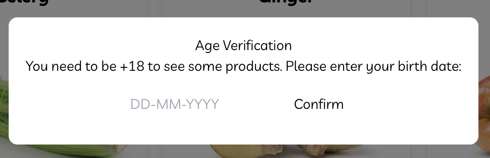
* 
* **Status:** PASSED

---

## TC-07 Altersverifikation: Über 18 aber falsches Format

* **Precondition:** Eingeloggt mit Email = `test@test32567.de`, Password = `test123`, Shop wird erstmals besucht
* **Steps:**
  1. Klicke auf **Shop**
  2. Warte, bis Altersverifikations-Popup erscheint.
  3. Gib Geburtsdatum `27.08.2007` ein.
  4. Klicke auf **Bestätigen**.
* **Expected Result:** Datum nicht erkannt, Nutzer wie unter 18 behandelt, Warn-Popup erscheint.
* **Actual Result:** Datum nicht erkannt, Nutzer wird als unter 18 behandelt, Warn-Popup erscheint.
* 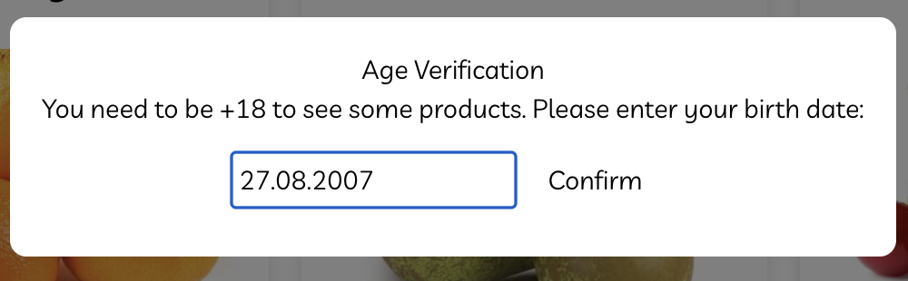
* 
* **Status:** PASSED

---

## TC-08 Versandkosten: Bestellwert = 25 €

* **Precondition:** Eingeloggt mit Email = `test@test32567.de`, Password = `test123`, Warenkorb leer, Versandregel: 5 €, kostenlos ab 25 €
* **Steps:**
  1. Wähle 10x `Cherries` (2,50 € pro Stück)
  2. Klicke auf **Add to Cart**
  3. Öffne Warenkorb, prüfe Kostenbereich
* **Expected Result:** Versandkosten = 0 €, Total = 25 €
* **Actual Result:** Versandkosten werden korrekt mit 0 € angezeigt Total korrekt mit 25€.
* 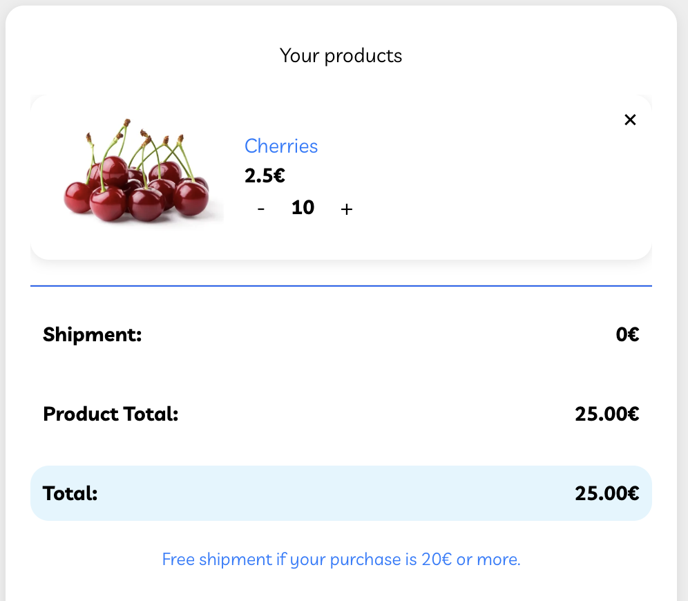
* **Status:** PASSED

---

## TC-09 Versandkosten: Bestellwert < 25 €

* **Precondition:** Eingeloggt mit Email = `test@test32567.de`, Password = `test123`, Warenkorb leer, Versandregel: 5 €, kostenlos ab 25 €
* **Steps:**
  1. Wähle 2x `Cherries` (2,50 € pro Stück)
  2. Klicke auf **Add to Cart**
  3. Öffne Warenkorb, prüfe Kostenbereich
* **Expected Result:** Versandkosten = 5 €, Total = 10 €
* **Actual Result:** Versandkosten korrekt bei 5 €, Total korrekt bei 10 € (5 € Versand + 5 € Wahrenwert).
* 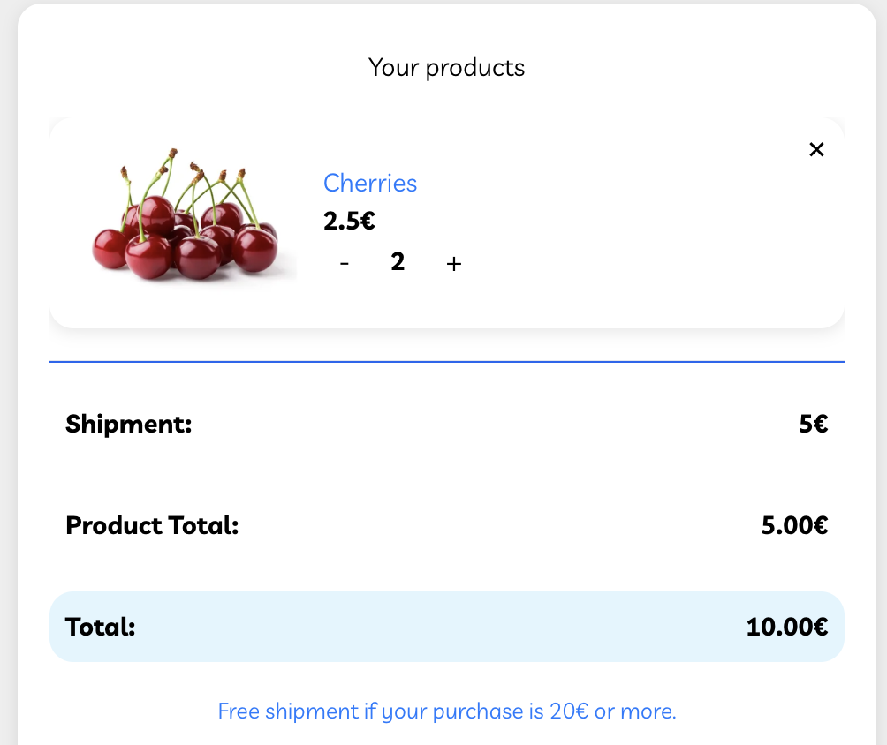
* **Status:** PASSED

---

## TC-10 Versandkosten: Änderung nach Entfernung von Produkten

* **Precondition:** Eingeloggt mit Email = `test@test32567.de`, Password = `test123`, Warenkorb leer, Versandregel: 5 €, kostenlos ab 25 €
* **Steps:**
  1. Wähle 7x `Cherries` + 1x `Pink Lady Apples` (20 €)
  2. Klicke auf **Add to Cart**
  3. Öffne Warenkorb → Versandkosten prüfen (0 €)
  4. Entferne `Pink Lady Apples` damit der Warenwert <20 € entspricht
  5. Versandkosten erneut prüfen
* **Expected Result:** Versandkosten wieder auf 5 € gesetzt
* **Observed Result / Bug:** Versandkosten bleiben 0 €
* **Actual Result:** Versand wird **NICHT** auf 5 € hoch gesetzt sondern bleibt bei 0 €.
* 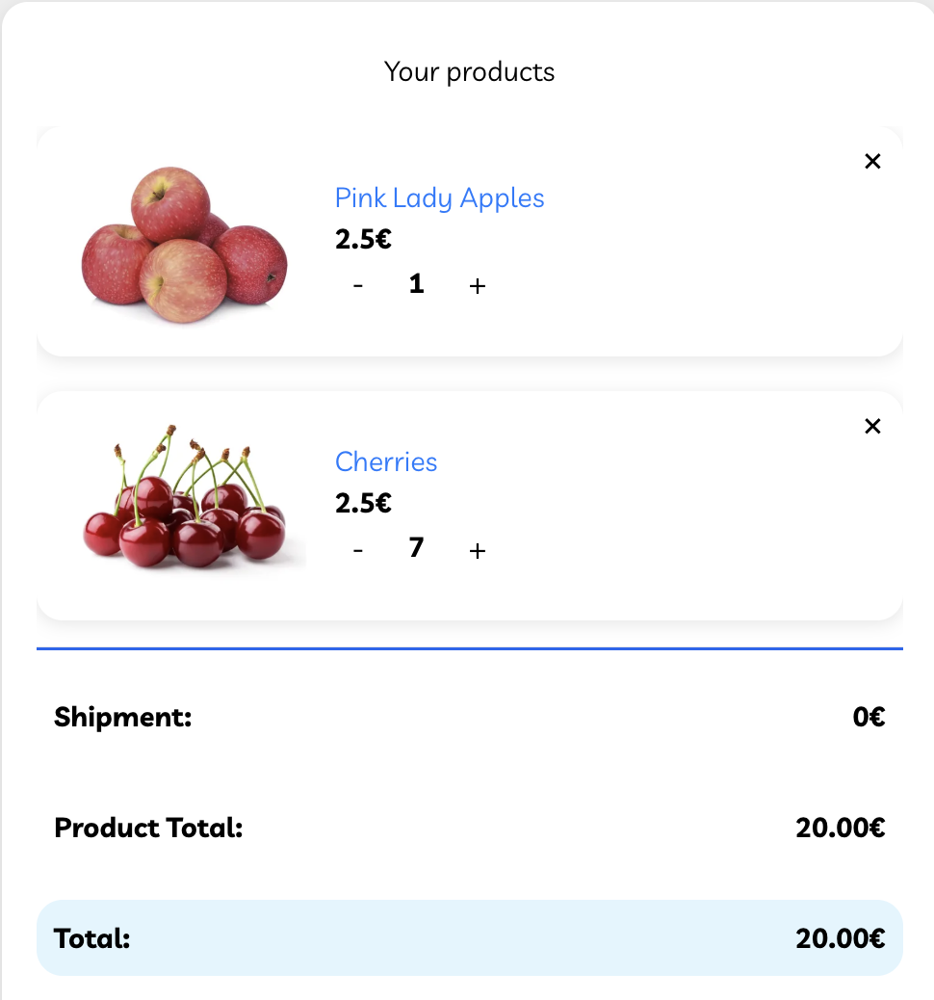
* 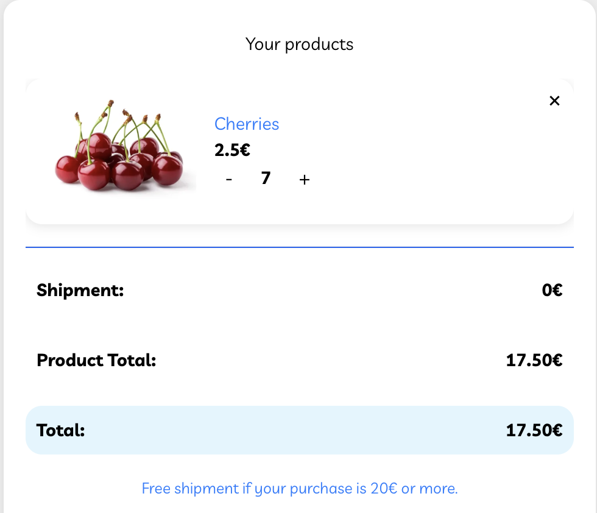
* **Status:** FAILED
