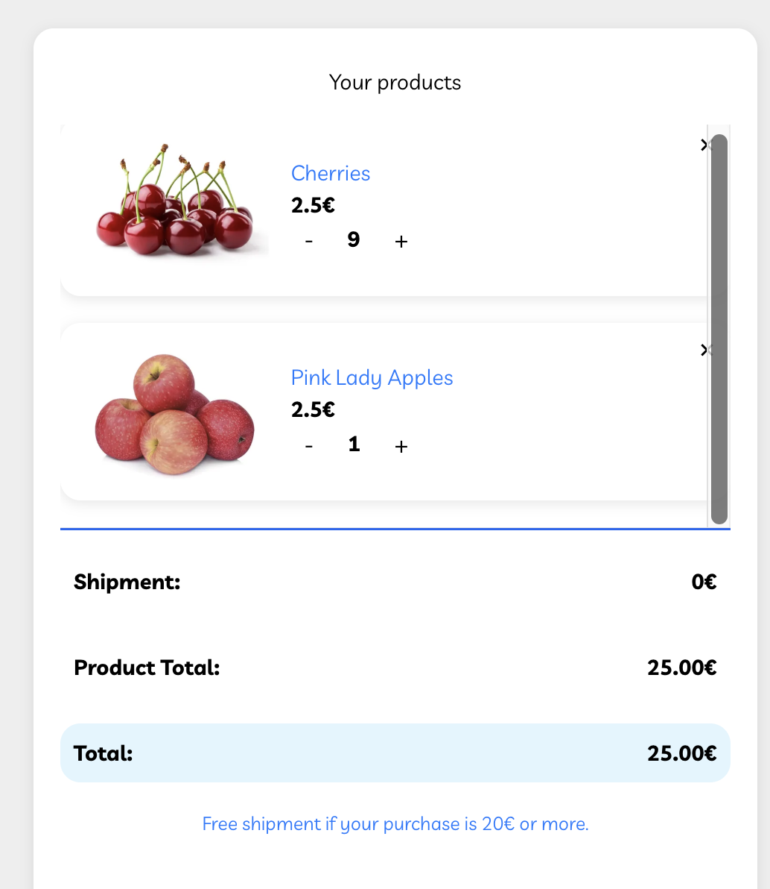
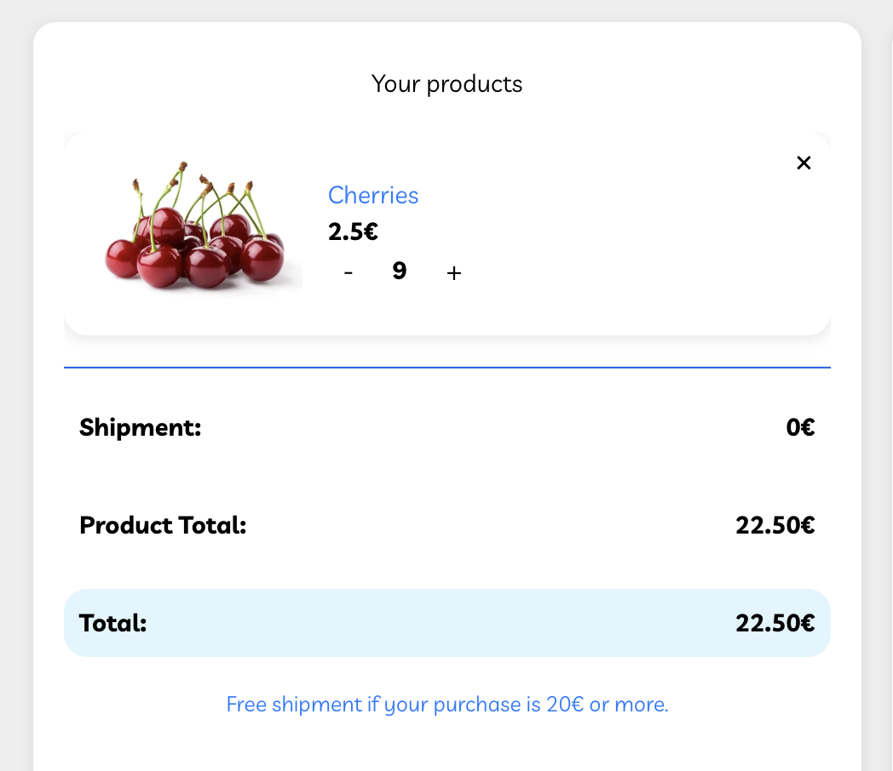
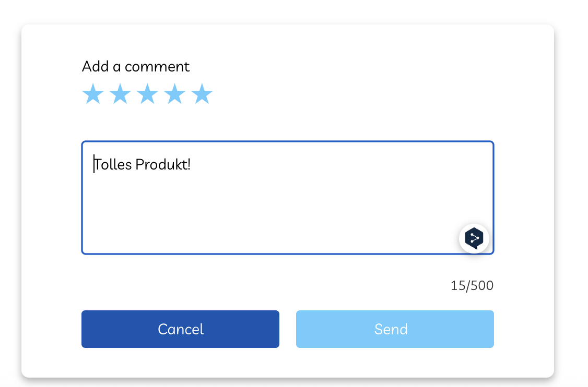
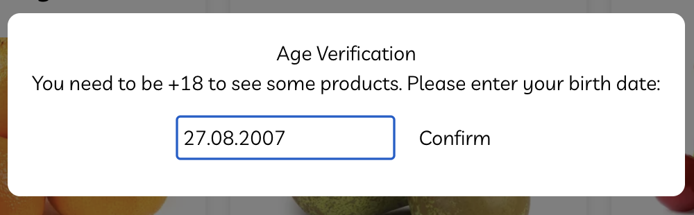
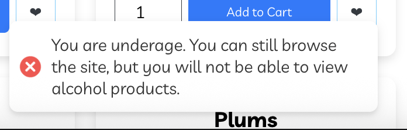

# Bug Reports - GroceryMate

**Reporter:** Marc Maier  
**Datum:** 21.11.2025  
**Testumgebung:** Chrome 142 / MacOS 15.6.1  
**Anwendung:** GroceryMate   

---

## Bug-001: Versandkosten ändern sich nicht nach Produktentfernung

* **Priorität:** Hoch
* **Reproduktionsschritte:**
  1. Wähle 9x `Cherries` + 1x `Pink Lady Apples` (Warenwert = 25 €)  
  2. Klicke auf **Add to Cart**  
  3. Öffne den Warenkorb, Versandkosten prüfen (0 €)  
  4. Entferne `Pink Lady Apples` → Warenwert < 25 €  
  5. Versandkosten erneut prüfen
* **Erwartetes Ergebnis:** Versandkosten sollten wieder auf 5 € gesetzt werden, Total korrekt aktualisiert.
* **Tatsächliches Ergebnis:** Versandkosten bleiben auf 0 €, Total nicht korrekt aktualisiert.
* **Screenshots / Anhänge:**
  * 
  * 
* **Zusätzliche Informationen:** Kritischer Fehler, da die Versandregel nicht korrekt umgesetzt wird.

---

## Bug-002: Produkt bewerten (5 Sterne + Kommentar)

* **Priorität:** Mittel
* **Reproduktionsschritte:**
  1. Scrolle auf Produktseite von `Cherries` zum Bewertungsbereich  
  2. Wähle 5 Sterne  
  3. Trage Kommentar "Tolles Produkt!" ein  
  4. Klicke auf **Send**
* **Erwartetes Ergebnis:** 
  * Die Bewertung wird erfolgreich gespeichert.
  * In der Bewertungsübersicht erscheint ein neuer Eintrag mit:
    * **Sternebewertung:** 5 von 5 Sternen(5 ausgefüllte Sterne werden angezeigt)
    * **Kommentar:** "Tolles Produkt!"
    * **Username:** Der korrekte Username des eingeloggten Nutzers wird angezeigt
* **Tatsächliches Ergebnis:** Username und Sterne werden angezeigt. Der Kommentar fehlt
* **Screenshots / Anhänge:** 
  * 
  * 

---

## Bug-003: Altersverifikation mit falschem Datumsformat behandelt Nutzer wie unter 18

* **Priorität:** Mittel
* **Reproduktionsschritte:**
  1. Warte auf Altersverifikations-Popup beim ersten Shop-Besuch  
  2. Gib Geburtsdatum `27.08.2007` ein (Punkte statt Bindestriche)  
  3. Klicke auf **Bestätigen**
* **Erwartetes Ergebnis:** System erkennt das korrekte Alter, Zugriff auf alkoholische Produkte erlaubt.
* **Tatsächliches Ergebnis:** Nutzer wird wie unter 18 behandelt, Zugriff auf alkoholische Produkte gesperrt.
* **Screenshots / Anhänge:**
  * 
  * 
* **Zusätzliche Informationen:** Falsches Format wird nicht korrekt validiert.
